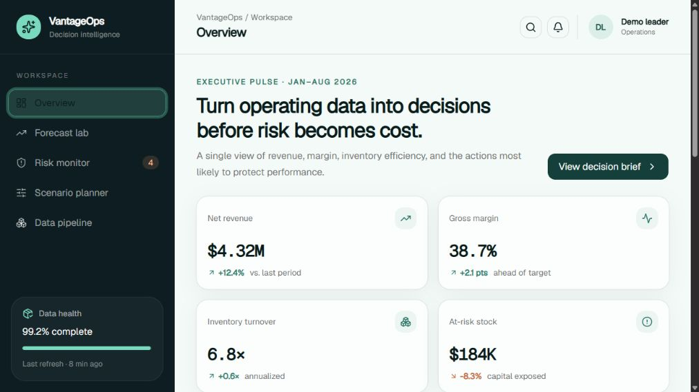
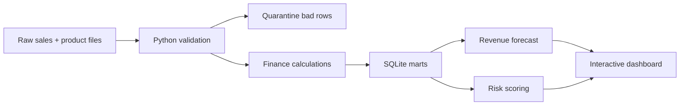
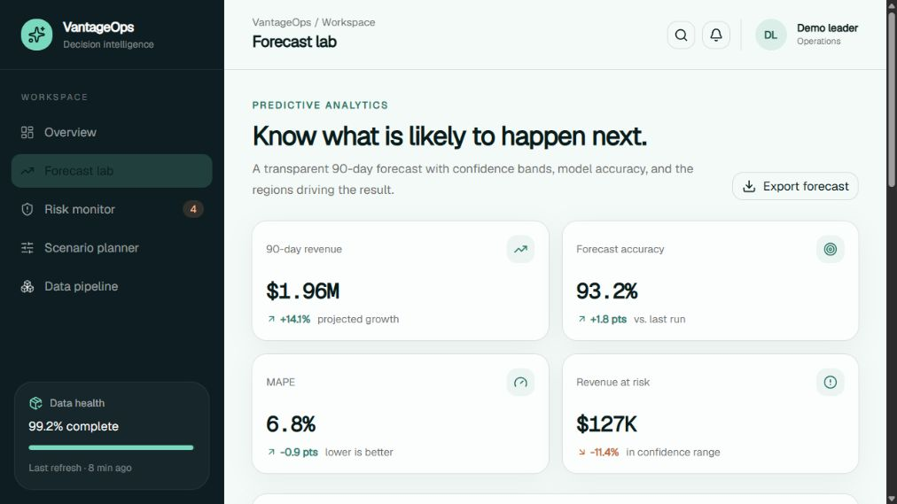
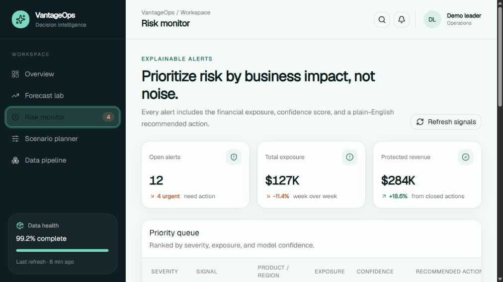
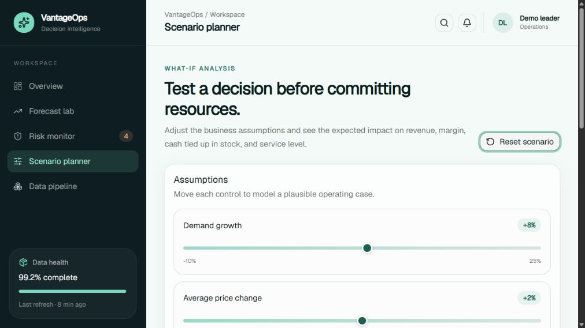
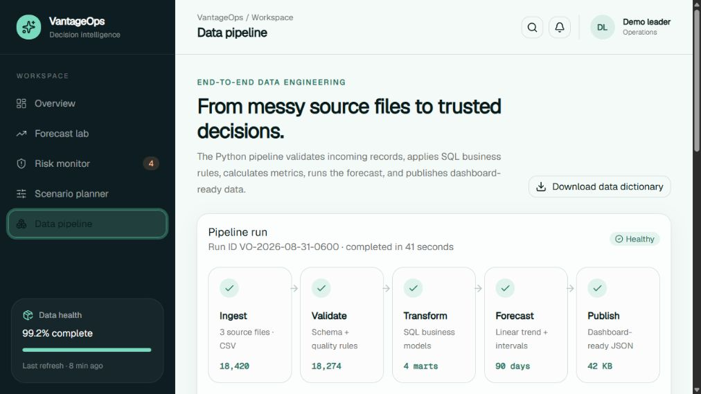

# VantageOps

**Enterprise resource and analytics dashboard powered by a Python data pipeline.**

[](https://github.com/dismality/vantageops/actions/workflows/ci.yml)


> **[Open the live recruiter demo](SITE_URL_PLACEHOLDER)**

VantageOps turns raw sales, product, supplier, and inventory records into decisions an operations leader can act on. It demonstrates the full path from data ingestion and quality checks to SQL models, KPIs, forecasting, risk alerts, and an interactive executive dashboard.



## Why I built this

Business teams often lose time joining spreadsheets, checking whether numbers are trustworthy, and explaining what changed. A useful analytics product should do more than display charts: it should show where a metric came from, what may happen next, and what action is worth taking.

This portfolio project is designed for **Business Intelligence Analyst, Data Engineer, Technology Risk Analyst, Technical Product Manager, and Analytics Consultant** roles.

## The idea, in one minute

VantageOps follows a simple flow:



- **Python** creates realistic sample data, validates it, and calculates business metrics.
- **SQL/SQLite** stores clean facts and reusable monthly performance tables.
- **NumPy** creates an explainable trend forecast with a confidence range.
- **React and Recharts** present the result as an executive decision workspace.
- **Automated tests and CI** check the calculations and production build on every change.

## Features, explained in simple English

### 1. Executive overview

This page answers, “How is the business doing right now?” It puts revenue, margin, inventory efficiency, and exposed stock in one place. The decision brief translates the biggest signal into a concrete next step.


### 2. Forecast lab

This page answers, “What is likely to happen over the next 90 days?” It shows expected revenue, the reasonable high and low range, forecast accuracy, and which regions are above or below target. The method is intentionally simple and explainable.



### 3. Risk monitor

This page answers, “What needs attention first?” Alerts are ranked by severity and estimated financial exposure. Each row includes a confidence score and a recommended action, so a manager does not have to interpret a vague warning.



### 4. Scenario planner

This page answers, “What could happen if we change the plan?” Move the demand, price, cost, and inventory controls to see revenue, gross margin, working capital, and service level update immediately. It helps compare a decision before money is committed.



### 5. Data pipeline

This page answers, “Can I trust these numbers?” It shows every stage from source-file ingestion to published dashboard data. A CSV chooser demonstrates the ingestion experience, while the scorecard explains which quality rules keep bad records out.



## Business value

VantageOps is framed around outcomes, not only technology:

| Business problem | VantageOps response | Measure to track in a real rollout |
| --- | --- | --- |
| Analysts rebuild weekly reports by hand | One repeatable pipeline publishes all dashboard metrics | Reporting hours saved per week |
| Leaders discover stock problems too late | Alerts rank risk by estimated financial exposure | Revenue protected and stockouts avoided |
| Forecasts are difficult to challenge | Confidence ranges and accuracy measures are visible | MAPE and forecast bias |
| Teams debate different versions of a KPI | Finance logic is calculated once in the clean data model | Reconciliation issues per month |
| Decisions rely on intuition alone | Scenario controls show trade-offs before execution | Scenario adoption and outcome variance |

An illustrative adoption target is to reduce a 10-hour weekly reporting process by **60–80%**. That is a product hypothesis for a future pilot, not a claim measured from this synthetic demo.

## Run it locally

### Dashboard

```bash
npm install
npm run dev
```

Open `http://localhost:3000`.

### Python analytics pipeline

```bash
python -m venv .venv
# Windows: .venv\Scripts\activate
# macOS/Linux: source .venv/bin/activate
pip install -r requirements.txt
python -m pipeline.main
pytest -q
```

The pipeline generates 18,420 synthetic source rows, accepts 18,274 valid rows, and quarantines 146 deliberate quality problems. Outputs are written to `data/processed/`, including CSV marts, a SQLite database, a forecast file, and dashboard-ready JSON.

## KPI definitions

| Metric | Plain-English definition |
| --- | --- |
| Net revenue | Sales after discounts |
| Gross margin | Revenue left after product and freight costs, shown as a percentage |
| Inventory turnover | How often inventory value is sold and replaced in a year |
| Financial exposure | Estimated revenue or margin that an unresolved risk could affect |
| MAPE | Average forecast error as a percentage; lower is better |
| Service level | Percentage of orders expected to be fulfilled on time |

## Project structure

```text
vantageops/
├── app/                     # Web application entry and visual theme
├── components/              # Interactive dashboard and UI components
├── pipeline/                # Python generation, validation, metrics, and forecast
├── sql/                     # Reusable analytics transformation
├── tests/                   # Python calculation and data-quality tests
├── docs/images/             # Real screenshots captured from the running app
├── .github/workflows/       # Continuous integration checks
├── Dockerfile               # Reproducible frontend and analytics build stages
└── requirements.txt         # Python dependencies
```

## Engineering choices

- **Synthetic data by default:** anyone can run the project without exposing company information.
- **Quarantine instead of silent deletion:** rejected records remain available for review.
- **Explainable forecasting:** the demo uses a transparent trend model instead of a black box.
- **Traceable metrics:** every headline number has one calculation path in the Python/SQL layer.
- **No secrets in the browser:** the deployed demo needs no API key and contains no private data.
- **Honest portfolio claims:** business-impact numbers are clearly labeled as targets or hypotheses.

## Verification

The repository includes four Python tests covering schema rejection, known bad-row quarantine, KPI boundaries, and forecast output. The production dashboard build also runs in GitHub Actions.

```bash
pytest -q
npm run build
```

## Next production steps

For a real company deployment, I would replace CSV inputs with scheduled warehouse ingestion, add role-based access, store quality exceptions for analysts to resolve, compare multiple forecasting models, and add monitoring for data freshness and model drift.

## License

MIT — see [LICENSE](LICENSE).
